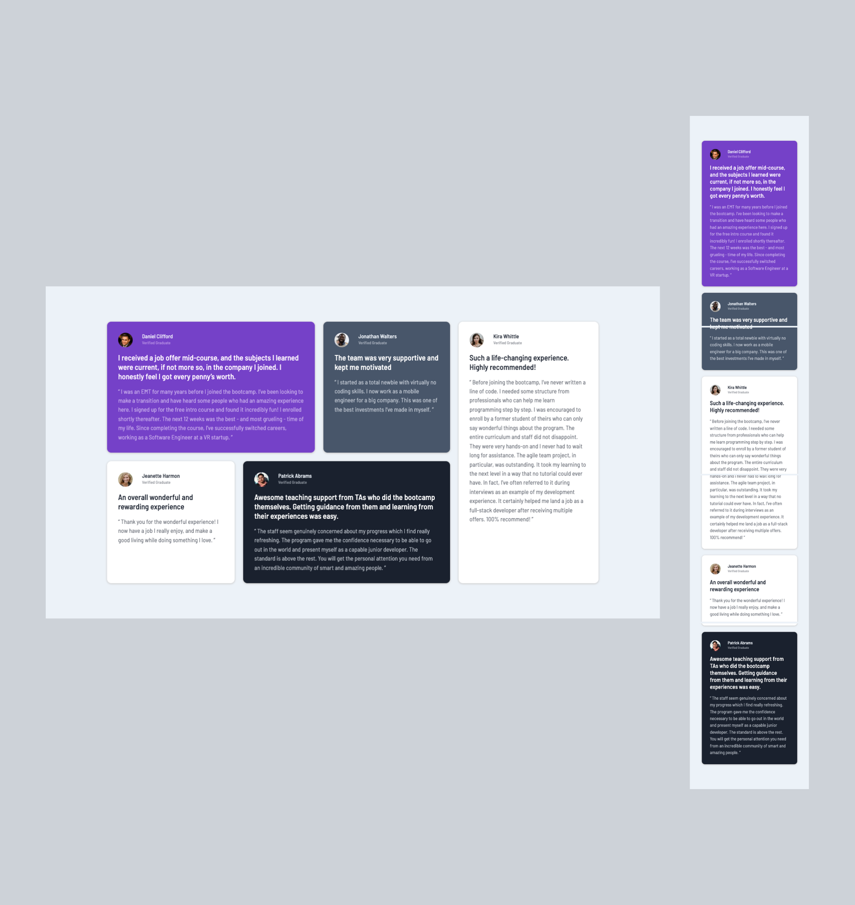

# Frontend Mentor - Testimonials grid section solution

## Table of contents

- [Overview](#overview)
  - [The challenge](#the-challenge)
  - [Screenshot](#screenshot)
  - [Links](#links)
- [My process](#my-process)
  - [Built with](#built-with)
  - [What I learned](#what-i-learned)
  - [Continued development](#continued-development)
  - [Useful resources](#useful-resources)
- [Author](#author)
- [Acknowledgments](#acknowledgments)

## Overview

### The challenge

Users should be able to:

- View the optimal layout for the site depending on their device's screen size

### Screenshot



### Links

- Solution URL: [Check out my solution](https://www.frontendmentor.io/solutions/testimonials-grid-section-qE3jXavUC8)
- Live Site URL: [Check out my live site](https://omowunmikamil.github.io/testimonials-grid-section.github.io/)

## My process

### Built with

- Semantic HTML5 markup
- CSS custom properties
- CSS variables
- Flexbox
- CSS Grid
- Mobile-first workflow (Responsive on mobile)

### What I learned

```html
<h1>Some HTML code I'm proud of</h1>
<main id="grid-container"></main>
<section class="item-1"></section>
<article></article>
<div class="img"></div>

<h1></h1>
<h2></h2>
<p></p>
```
```css
section article:first-child p {
  font-size: 0.75em;
  color: var(--light-grayish-blue);
  font-weight: var(--light-font-weight);
  opacity: 50%;
  padding-top: 0;
}

#grid-container {
  display: grid;
  grid-template-areas:
    'a a b c'
    'd e e c'
    ;
  gap: 20px;
  width: 80%;
  margin: auto;
}

.item-1 {
  background-color: var(--moderate-violet);
  grid-area: a;
}

.item-2 {
  background-color: var(--very-dark-grayish-blue);
  grid-area: b;
}

.item-3 {
  background-color: var(--white);
  grid-area: c;
}

#grid-container section:nth-child(3) h1 {
  color: var(--very-dark-blackish-blue);
}

#grid-container section:nth-child(3) p {
  color: var(--very-dark-blackish-blue);
}

#grid-container section:nth-child(3) h2 {
  color: var(--very-dark-blackish-blue);
}

#grid-container section {
  padding: 2em;
  text-align: left;
  border-radius: 10px;
  box-shadow: 0 1px 4px 1px var(--light-gray);
}
@media screen and (width: 375px) {
  #grid-container {
    grid-template-areas:
        'a a'
        'b b'
        'c c'
        'd d'
        'e e';
    margin: 6em auto;
  }
}
```

### Continued development

CSS Layouts

### Useful resources

- [w3schools](https://www.w3schools.com/css/css_grid_container.asp) - This helped me with the grid implementations. I really liked this pattern and will use it going forward.

## Author

- Website - [Visit my Portfolio Website](https://omowunmikamil.tech)
- Frontend Mentor - [Omowunmi Kamiludeen](https://www.frontendmentor.io/profile/Omowunmikamil)
- Twitter - [Browser_Nerd](https://www.twitter.com/@Browser_Nerd)

## Acknowledgments

- **Frontend Mentor** - For making this challenge and resources available 